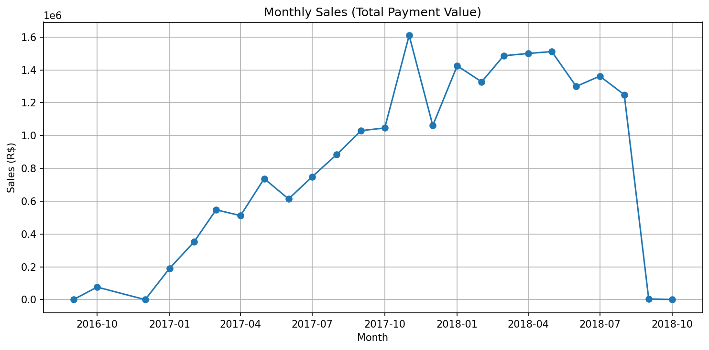
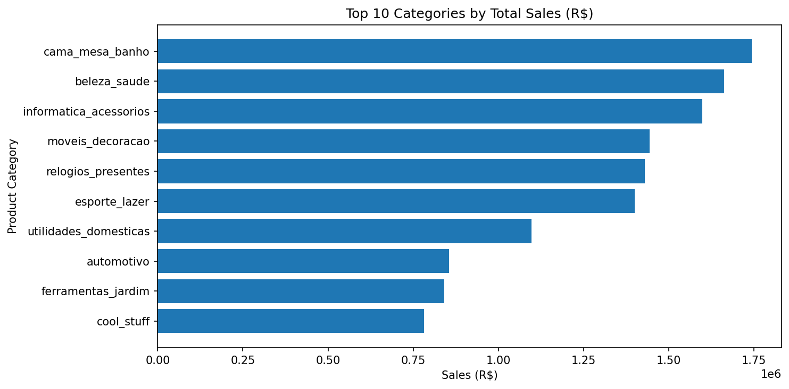
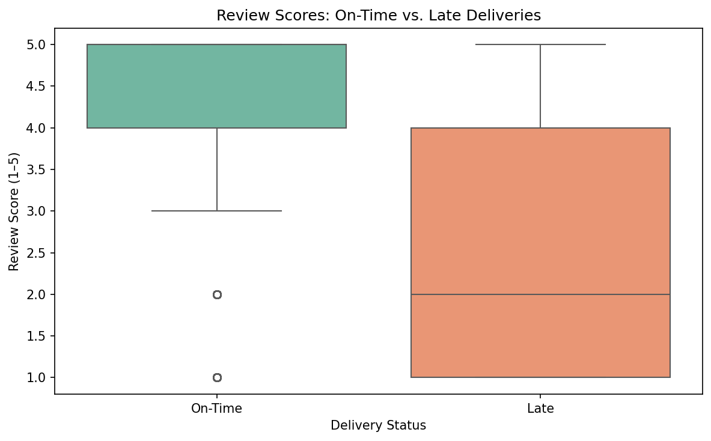

📊 Olist Brazilian E-Commerce Analysis
📌 Project Overview

This project explores the Olist E-Commerce dataset
, which contains ~100k orders from 2016 to 2018.
The goal is to analyze sales trends, customer satisfaction, and product performance in order to uncover insights that can guide business decisions.

🎯 Objectives

Understand sales growth over time.

Identify top-selling product categories and compare them with high-satisfaction categories.

Explore the distribution of customer review scores.

Test the hypothesis: Do late deliveries significantly reduce review scores?

🗂️ Dataset Components Used

orders – order status and timestamps.

customers – customer details and location.

order_items – products purchased in each order.

products – product category and attributes.

payments – payment method and value.

reviews – customer review scores and comments.

🔎 Exploratory Data Analysis (EDA)
1. Sales Trend

📈 Sales grew sharply in 2017 and stabilized at ~1.4–1.6M R$ per month in 2018.

2. Product Categories

Revenue Leaders: household & lifestyle products (bed & bath, beauty & health, IT accessories).

Satisfaction Leaders: books, media, and flowers.
👉 Revenue ≠ Satisfaction → important gap for strategy.

3. Review Distribution

75% of reviews are positive (4–5 stars).

13% of reviews are 1-star → mostly linked to late deliveries.

4. Hypothesis Test: Late Deliveries

On-time deliveries: avg score = 4.2

Late deliveries: avg score = 2.5

p-value < 0.001 → statistically significant.

✅ Key Findings

🚀 Olist scaled rapidly during 2017, reaching stable high volumes in 2018.

🏷️ Household and lifestyle categories bring the most revenue.

😊 Highest customer satisfaction is in books/media, not top revenue categories.

🚚 Late deliveries are the main driver of negative reviews.

💡 Business Recommendations

Improve logistics performance to reduce late deliveries and boost review scores.

Balance strategy between revenue-driving categories (household, lifestyle) and loyalty-driving categories (books, media).

Monitor categories with both high sales and low scores (e.g., electronics, furniture) to identify operational pain points.

Use review analytics to continuously track customer satisfaction KPIs.

🛠️ Tech Stack

Python (Pandas, NumPy, Matplotlib, Seaborn, SciPy)

Jupyter Notebook

Git/GitHub

📂 Project Structure
── data/                # CSV files (not uploaded due to size)
── notebooks/           # Jupyter notebooks with analysis
── reports/             # Saved plots for README
── README.md            # Project documentation

 Acknowledgements

Dataset from Kaggle – Brazilian E-Commerce by Olist
.
